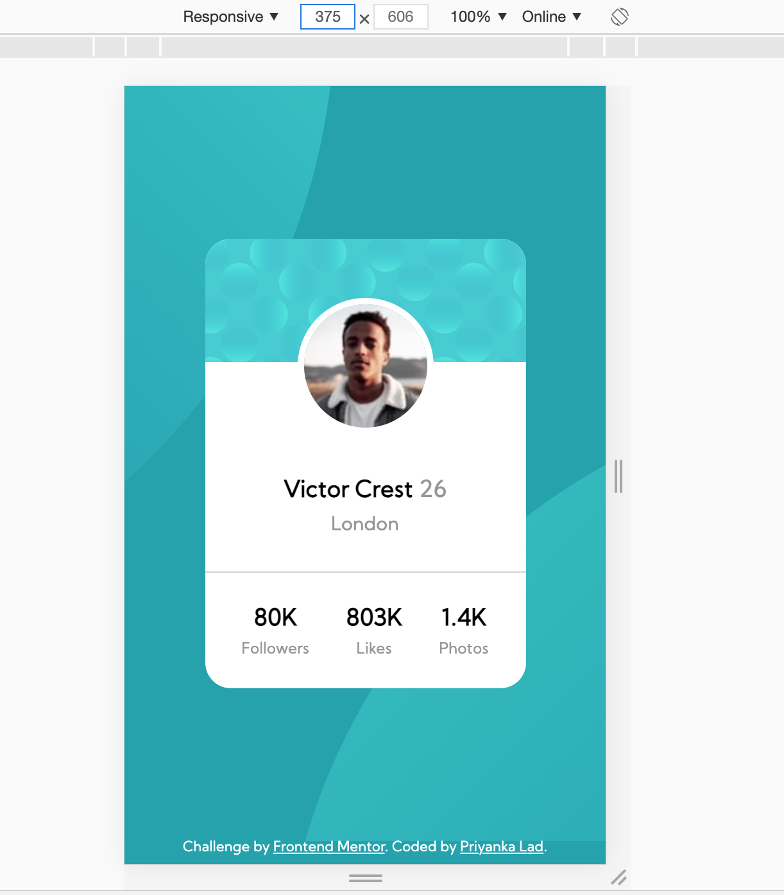
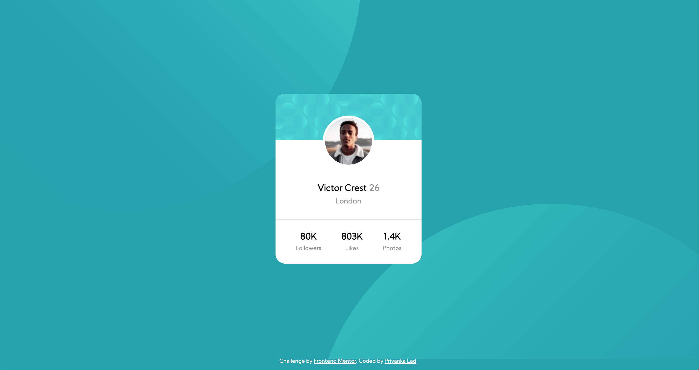

# Frontend Mentor - Profile card component solution

This is a solution to the [Profile card component challenge on Frontend Mentor](https://www.frontendmentor.io/challenges/profile-card-component-cfArpWshJ).

## Table of contents

- [Overview](#overview)
  - [The challenge](#the-challenge)
  - [Screenshot](#screenshot)
  - [Links](#links)
- [My process](#my-process)
  - [Built with](#built-with)
  - [What I learned](#what-i-learned)
  - [Continued development](#continued-development)
  - [Useful resources](#useful-resources)
- [Author](#author)

## Overview

- This challenge is of level Newbie
- Implemented using flexbox.
- Below if the structute
  - The main container with class "container" is a flexbox with flex-direction row
  - "container" another flexbox container called class "card" with flex-direction column
  - "card" has 3 flex items
    1. profileBGImage -> div with bg image
    2. profileDetails -> Flex container with flex direction column
    3. profileStats -> flex container with flex direction row

### The challenge

- The most difficult part for me was to adjust two background images "bg-pattern-bottom.svg" and "bg-pattern-top.svg". Initially I tried with "position:absolute", but in final version I am using background-position property with unit percentage. I am still not satisfied with this implementation. I would to know more sophisticated way to implement this feature.
- Second difficulty I face is with the image "image-victor.jpg". Currently I have implemented with "position:relative" and "bottom :60px". I am not sure if it's a right approach.

### Screenshot




### Links

- Solution URL: (https://wonderful-snyder-c70030.netlify.app/)
- Live Site URL: (https://wonderful-snyder-c70030.netlify.app/)

## My process

### Built with

- CSS custom properties
- Flexbox
- Mobile-first workflow

### What I learned

- I am starting learn how to use media queries with this project. In this project, I have implemented the view for desktop

```css
@media (min-width: 1440px) {
  .card {
    width: 300px;
    height: 350px;
  }
  .container {
    background-position: -50% 230%, 140% -180%;
  }
}
```

- Representing color in form of hsl, is another new thing which I learnt.

### Continued development

As of now I need to work more on background responsive images, media queries, sematic html tags, how to plan the design before start coding.

### Useful resources

- [Example resource 1](https://www.youtube.com/watch?v=-Wlt8NRtOpo&t=1498s&ab_channel=freeCodeCamp.org) - This helped me to learn CSS Flexbox in detail.

## Author

- Frontend Mentor - [@yourusername](https://www.frontendmentor.io/profile/priyankalad)
